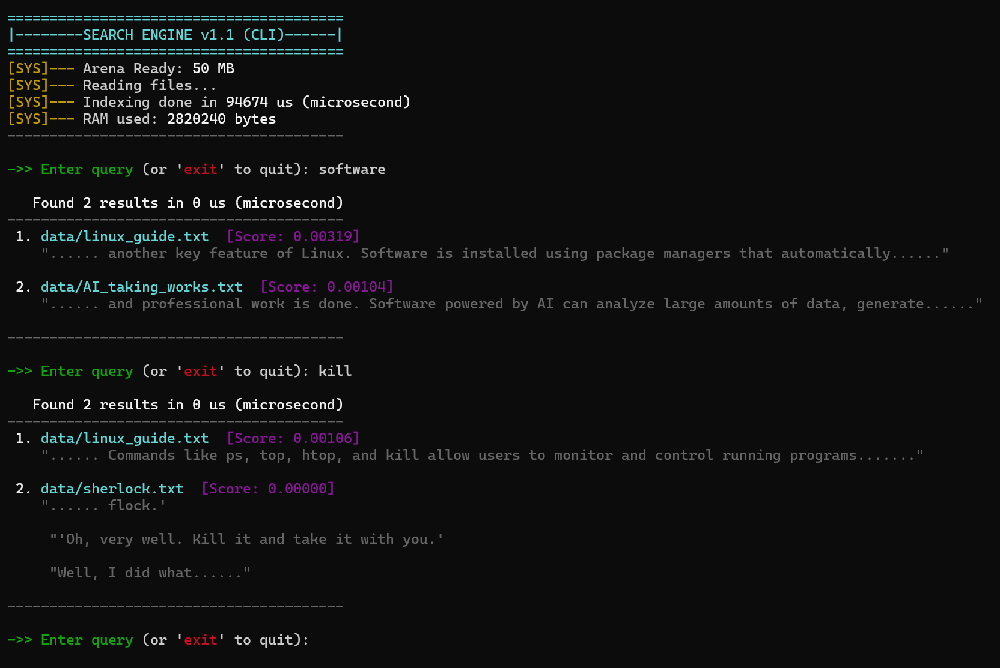

# High-Performance Search Engine (C++)

A high-efficiency text search engine built from scratch in C++. This project demonstrates low-level memory management, custom data structures, and relevance ranking algorithms to perform sub-microsecond keyword searches over large text corpora.

## Key Features

* **Custom Memory Arena:** Implemented a pre-allocated memory pool (`Arena`) to eliminate `malloc/free` overhead and improve CPU cache locality.
* **TF-IDF Relevance Ranking:** specific scoring algorithm (Term Frequency-Inverse Document Frequency) to sort search results by relevance rather than just boolean matching.
* **Inverted Index (Trie):** Utilizes a custom Trie data structure for O(L) search time complexity (where L is word length), independent of document set size.
* **Rich CLI Interface:** Features a color-coded command-line interface with distinct visual hierarchy for scores, filenames, and snippets.
* **KMP Algorithm:** Implements the Knuth-Morris-Pratt pattern matching algorithm to generate context-aware text snippets.

## Technical Stack

* **Language:** C++17
* **Build System:** CMake
* **Core Concepts:** Pointers, Memory Arenas, Trie, KMP Algorithm, TF-IDF.

## Performance

* **Indexing Speed:** ~0.08 seconds for standard datasets.
* **Search Latency:** < 1 microsecond (0 us) for indexed keywords.
* **Memory Efficiency:** Uses a contiguous memory block to minimize fragmentation.

## Demo & Output

Below is a capture of the engine running in a terminal. It highlights the custom Arena allocator initialization, sub-microsecond search times, and relevance scoring.



## 📂 Project Structure

```text
├── data/          # Text datasets for searching
├── include/       # Header files (Interface)
│   ├── arena.h    # Custom Memory Arena (Pool Allocator)
│   ├── kmp.h      # Knuth-Morris-Pratt Algorithm
│   └── trie.h     # Trie data structure for indexing
├── src/           # Source files (Implementation)
│   └── main.cpp   # Entry point and REPL loop
├── screenshots/   # Images for documentation
└── CMakeLists.txt # Build configuration
```

## Build & Run

### Prerequisites
Before running, ensure you have the following installed:
* **C++ Compiler:** GCC, Clang, or MSVC (supporting C++17 or later)
* **CMake:** Version 3.10+
* **Build System:** Make (Linux/Mac) or Ninja (Windows)

### Installation Steps

1.  **Clone the repository**
    ```bash
    git clone [https://github.com/MutantCoder123/Efficient-Search-Engine.git](https://github.com/MutantCoder123/Efficient-Search-Engine.git)
    cd Efficient-Search-Engine
    ```

2.  **Build the Project**
    I use an out-of-source build to keep the directory clean.
    ```bash
    mkdir build
    cd build
    cmake ..
    make
    ```
    *(Note: On Windows with MSVC, use `cmake --build .` instead of `make`)*

3.  **Run the Engine**
     **Important:** Run the executable from the project root so it can find the `data/` folder.

    ```bash
    # 1. Go back to the root directory
    cd ..

    # 2. Run the executable from here
    # Linux / Mac:
    ./build/main

    # Windows (Git Bash / PowerShell):
    ./build/main.exe
    ```
    *(Note: Ensure your `data` folder is in the same directory as the executable).*
    
## Future Improvements

* **Persistent Indexing (Serialization):**
    Currently, the engine rebuilds the inverted index in RAM every time it starts. I plan to implement custom binary serialization to save the Trie structure to disk (`index.bin`), allowing for near-instant startup times.

* **Multithreaded Indexing:**
    To handle massive corpora (GBs of text), I plan to use C++ `std::thread` and a thread-safe queue to parallelize the file reading and tokenization process, significantly reducing indexing latency.

* **Fuzzy Search (Approximate Matching):**
    Implementing **Levenshtein Distance** or **BK-Trees** to handle user typos (e.g., searching for "sftware" should still find "software").

* **Query Parser for Boolean Logic:**
    Extending the search capabilities to support complex queries with operators like `AND`, `OR`, and `NOT` (e.g., `"AI AND (automation OR robotics)"`).

* **Index Compression:**
    Applying **Variable-Byte Encoding** or **Delta Encoding** to the document ID lists in the inverted index to further reduce memory footprint by 30-50%.

## 📄 License
This project is open-source and available under the [MIT License](LICENSE).
